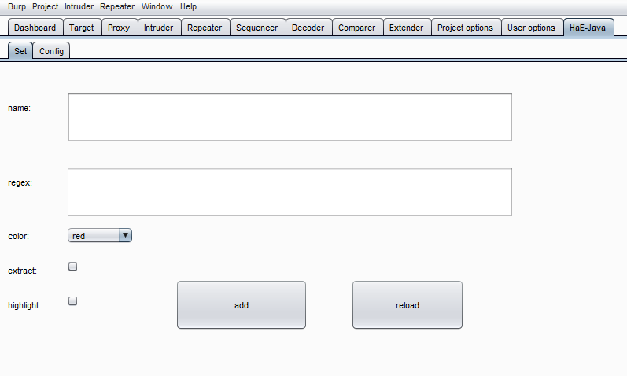
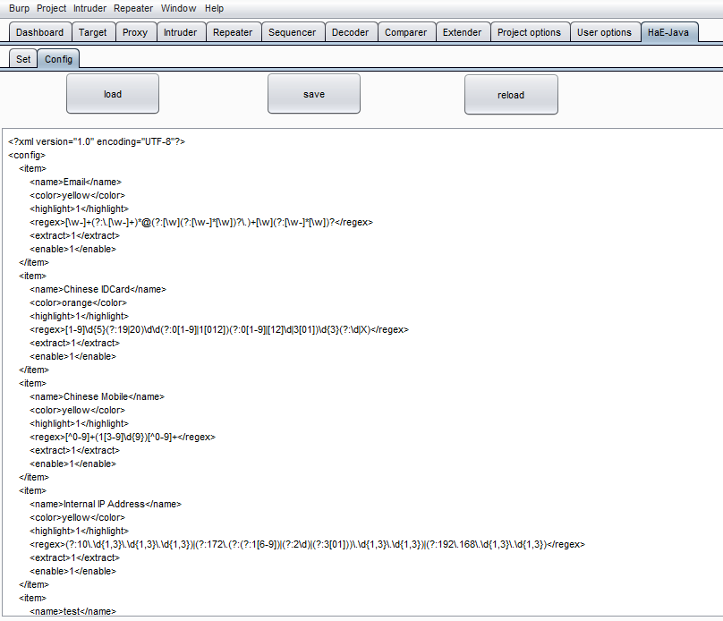
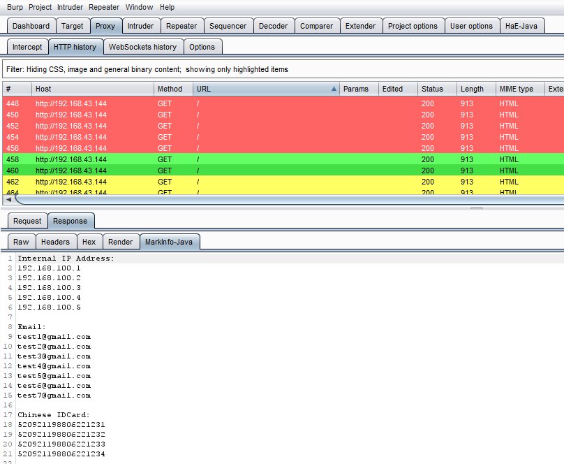

# **HaE-Java  信息高亮与提取插件（Java版本）**


**简介：**

HaE-Java是基于Java开发的一款burpsuite插件，其支持自定义正则表达式，可扩展性强，并内置九种高亮颜色，可高亮（**H**ighlight）标记敏感请求，并（**a**nd）提取（**E**xtract）关键数据，方便后续深度挖掘。代码内部维护了一个简单的缓存池，burp界面响应速度佳。


**解释下为何使用Java语言重新造一个轮子，理由有：**

1、学习Burp插件开发

2、方便后续进一步拓展


**使用：**

1、将HaE-Java.xml放在burpsuite.jar的同级目录（配置文件路径是个坑，后面可能会解决）

2、切换到burpsuite的extender标签页，加载HaE-Java.jar即可使用


**截图：**

1、添加单个配置项。add增加，reload生效。





2、修改配置项。load加载，save保存，reload生效。





3、高亮敏感请求，并在response标签页添加一个MarkInfo-Java子标签页，提取敏感数据。





**颜色高亮规则说明：**

1、颜色列表包括red、orange、yellow、green、cyan、blue、pink、magenta、gray，代表的严重程度是依次递减的。

2、较低严重程度的颜色出现两次之后，高亮的颜色会向上升级一个档次。举个例子，对于同一次请求，若cyan出现两次，高亮的颜色将会变为green，若orange出现两次，高亮的颜色将会变为red。


**配置文件格式说明举例：**

```
 <item>
        <name>Email</name>
        <color>green</color>
        <highlight>1</highlight>
        <regex>[\w-]+(?:\.[\w-]+)*@(?:[\w](?:[\w-]*[\w])?\.)+[\w](?:[\w-]*[\w])?</regex>
        <extract>1</extract>
        <enable>1</enable>
    </item>
```

color代表高亮的颜色，highlight代表是否高亮，regex代表正则，extract代表是否提取关键数据到MarkInfo-Java标签页，enable代表当前配置规则是否生效。


**感谢信息：**

设计灵感及代码实现参考了： https://github.com/gh0stkey/HaE    ，在此表示感谢


**使用声明：**

本工具仅供学习交流，请勿用于非法用途，如作他用所承受的法律责任一概与作者无关。
